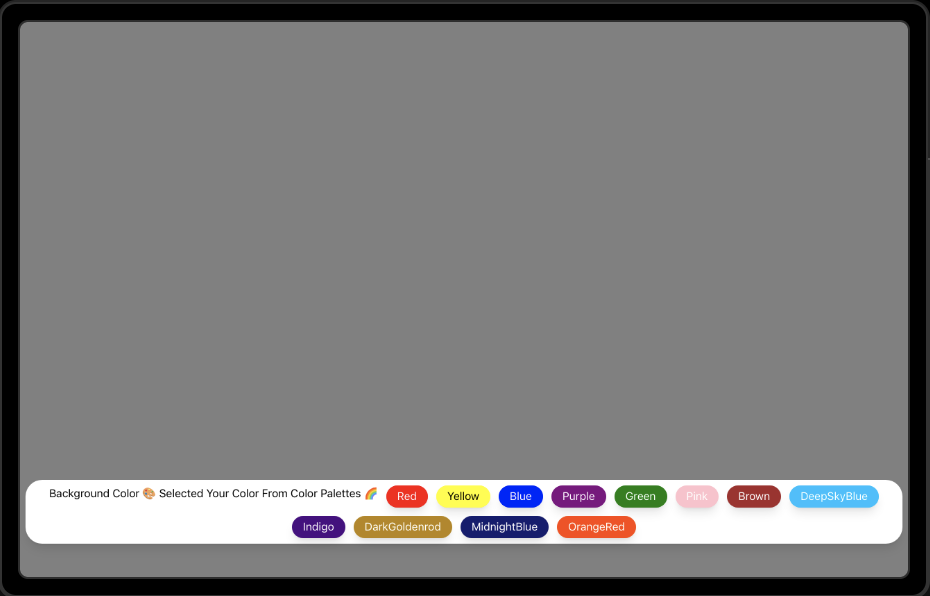

### Background Changer Project Documentation

The Background Changer project is a React application developed with Vite for efficient development, styled using Tailwind CSS, and deployed seamlessly with Vercel. This project aims to demonstrate the use of React state management for dynamically changing the background color using Tailwind CSS for styling.


### Demo :



### You can Check it Live on Below Link :

[Live Link !](https://bg-changer-theta.vercel.app/)

### Features
1. Dynamic Background: Allows users to dynamically change the background color by clicking the "Change Background" button.
2. React State: Utilizes React state management to keep track of the current background color.
3. Tailwind CSS: Employs Tailwind CSS for styling, providing a utility-first approach for a clean and responsive design.
4. Fast Development: Developed using Vite for quick and efficient development.
5. Deployment: Deployed effortlessly with Vercel, making it easy to share and access the project.

### Technologies Used
- React: A JavaScript library for building user interfaces.
- Vite: A build tool for React applications, providing a faster and more efficient development experience.
- Tailwind CSS: A utility-first CSS framework for building modern designs.
- Vercel: A cloud platform for static sites and serverless functions, facilitating seamless deployment.


###  Installation

To run the project locally, follow these steps:

1. Clone the repository:

```
git clone [repository-url]
cd background-changer

```

2. Install dependencies:

```
npm install

```

3. Run the development server:

```
npm run dev


```

The project will be accessible at http://localhost:3000.

### Usage
1. Open the project in a web browser.
2. Click the "Change Background" button to see the background color   dynamically change.
3. Observe the smooth transitions and the use of Tailwind CSS styles.


### Deployment

The Background Changer project is deployed using Vercel. Any changes pushed to the main branch are automatically deployed.


[Live Link !](https://bg-changer-theta.vercel.app/)


### Contributing
If you'd like to contribute to the project, please follow these steps:

1. Fork the repository.
2. Create a new branch for your feature or bug fix.
3. Make your changes and submit a pull request.